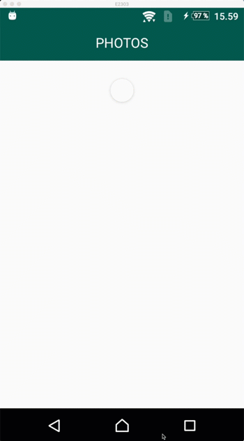
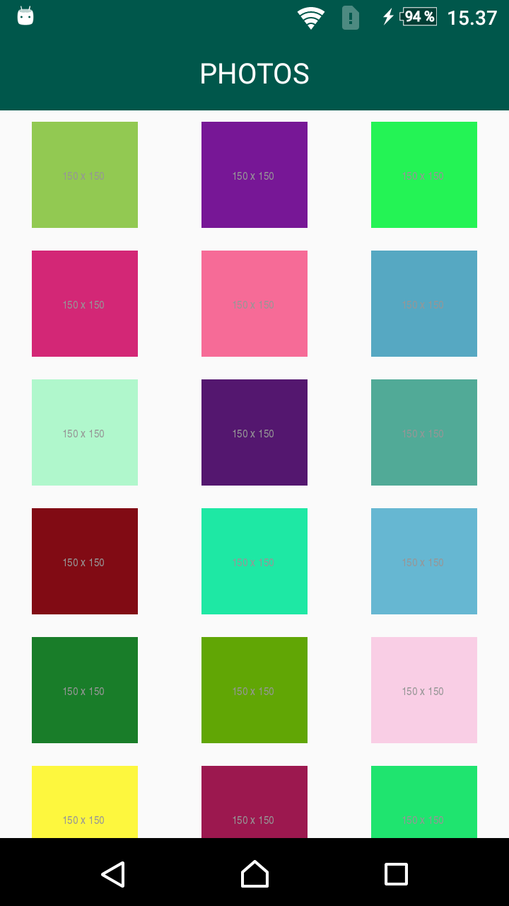
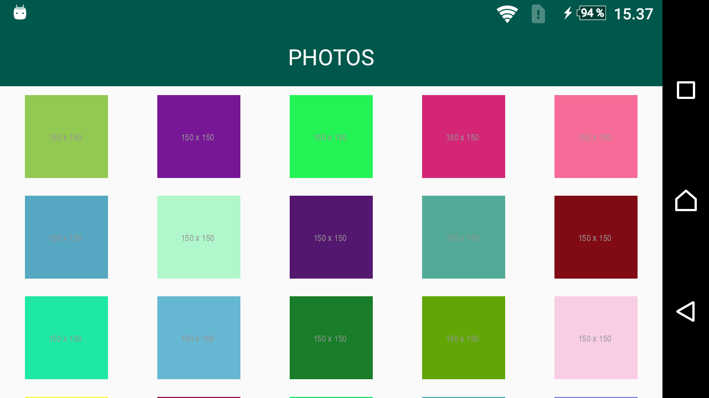
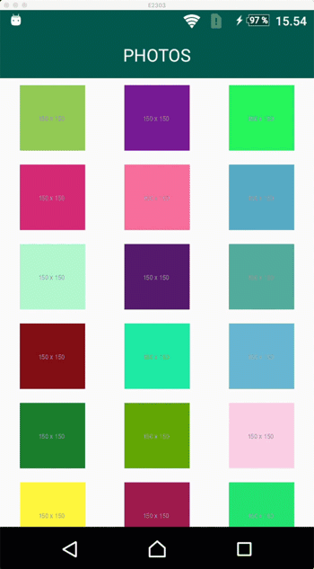
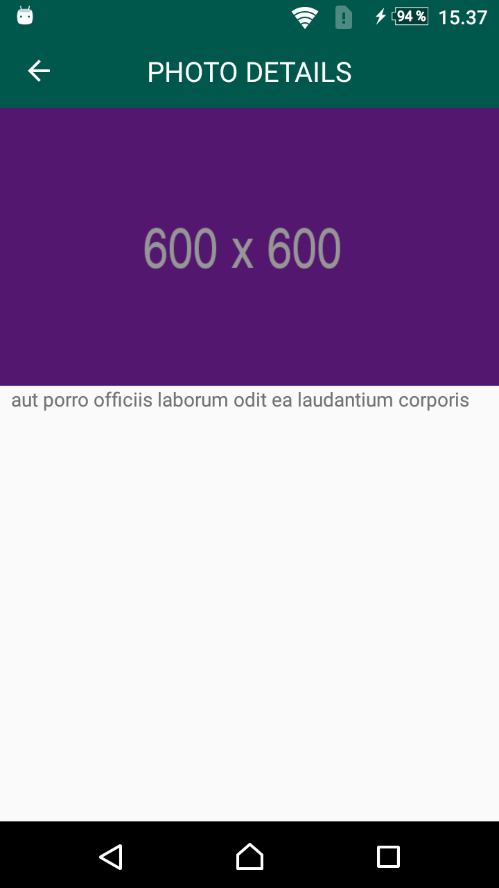
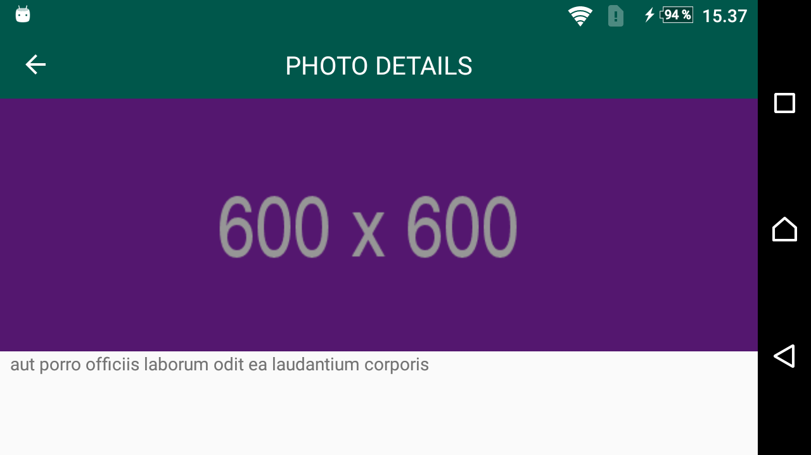

# Photos

## Overview
* Simple test app to practice MVx pattern 
* Using Dagger 2 for dependency injection 
* Uses [JSONPlaceholder](https://jsonplaceholder.typicode.com/) to get the data
* Written with Kotlin

## Libraries used

Here are the libraries used in this project and small info why it is used.

* [Dagger 2](https://github.com/google/dagger) - dependency injection
* [Picasso](https://github.com/square/picasso) - loading images
* [Retrofit](https://github.com/square/retrofit) - making API requests
* [OkHttp](https://github.com/square/okhttp) - for Picasso to use it when available (Retrofit also uses it under the hood)
* [Converter Moshi](https://github.com/square/retrofit/tree/master/retrofit-converters/moshi) - converting API response easily to objects
* [AndroidX](https://developer.android.com/jetpack/androidx/) - for supporting older Androids

## Links

* Great courses on Udemy, by Vasiliy Zukanov, that I learned a lot from
  * [Android Applications Architecture](https://www.udemy.com/android-architecture/)
  * [Dependency Injection in Android with Dagger 2](https://www.udemy.com/dependency-injection-in-android-with-dagger/)

## More Screenshots

### Photos
 

 

### Photo details
  